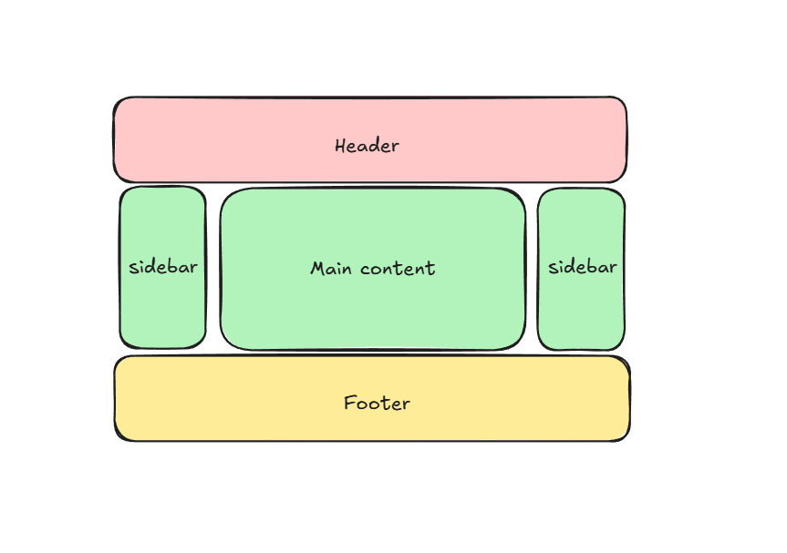

# Create a Holy Grail Layout using HTML, CSS

## Requirements

- Header at the top with a background.
- Footer at the bottom with a background.
- Three columns:
  - Main content taking up the center space with a background.
  - Left sidebar with a background.
  - Right sidebar with a background.

