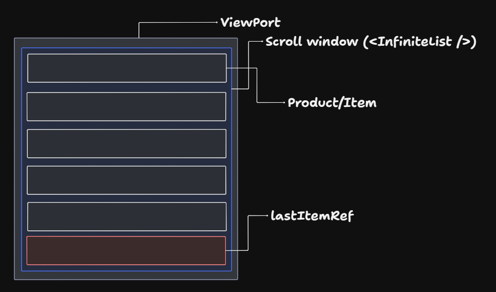

# Infinite Scroll Pagination (Data fetch: Page wise) - React

## Problem Statement

Design a reusable, scalable infinite pagination in React that can work across multiple lists, APIs, and UI variations, while being performant and accessible.

## Requirements

- Data fetching: page wise.
- Should work with large lists.
- Should avoid unnecessary re-renders.
- Should be reusable across the app.

## Architecture



- Design pattern to use: `Custom Hook` + `Render Props`
- The component `<InfiniteList />` takes two props
  - The `fetchFn` - Fetching data from API.
  - The `renderItem` - Component (list of items) to be render.
- Custom hook `useInfinitePagination` to manage pagination state, observe last element, trigger next page fetch, prevent duplicate calls.

## Data model

```js
<InfiniteList
  fetchFn={() => {}}
  renderItem={(item) => <ProductCard {...item} />}
/>
```

```js
const { items, lastItemRef, loading, error } = useInfinitePagination({
  fetchFn,
});
```

## I (not required)

## O (will discuss)
